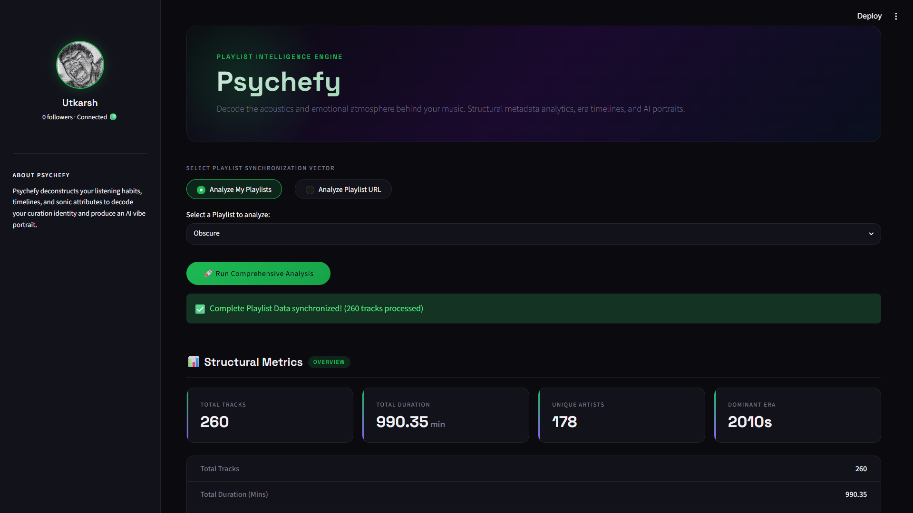
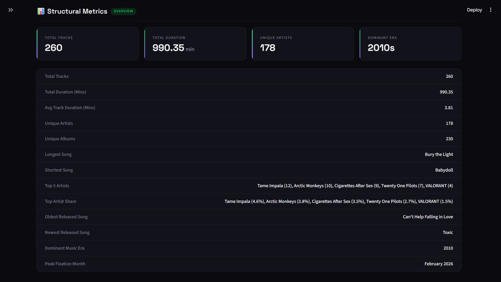
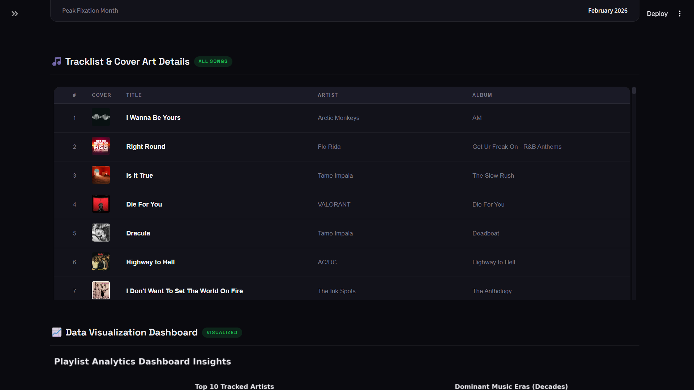
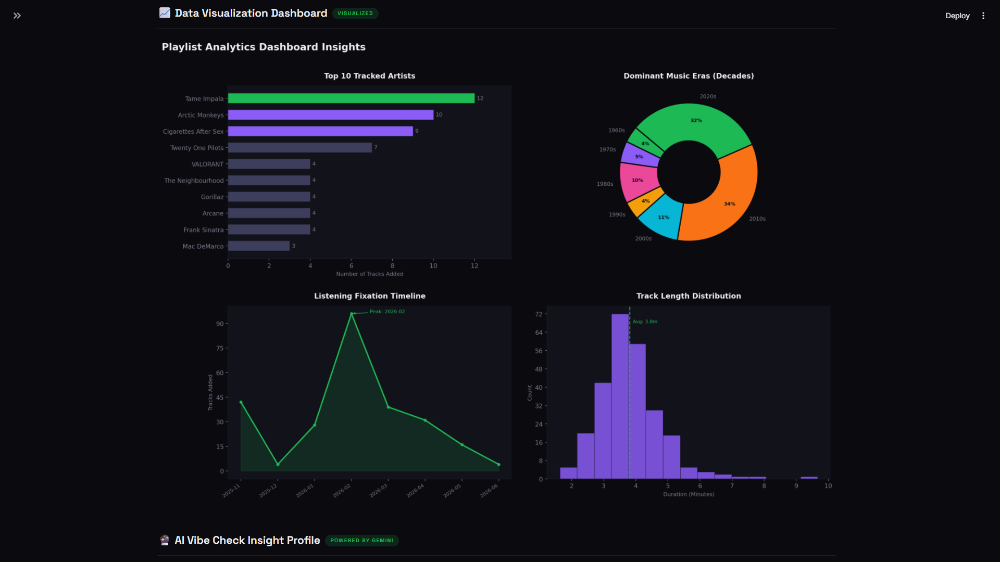
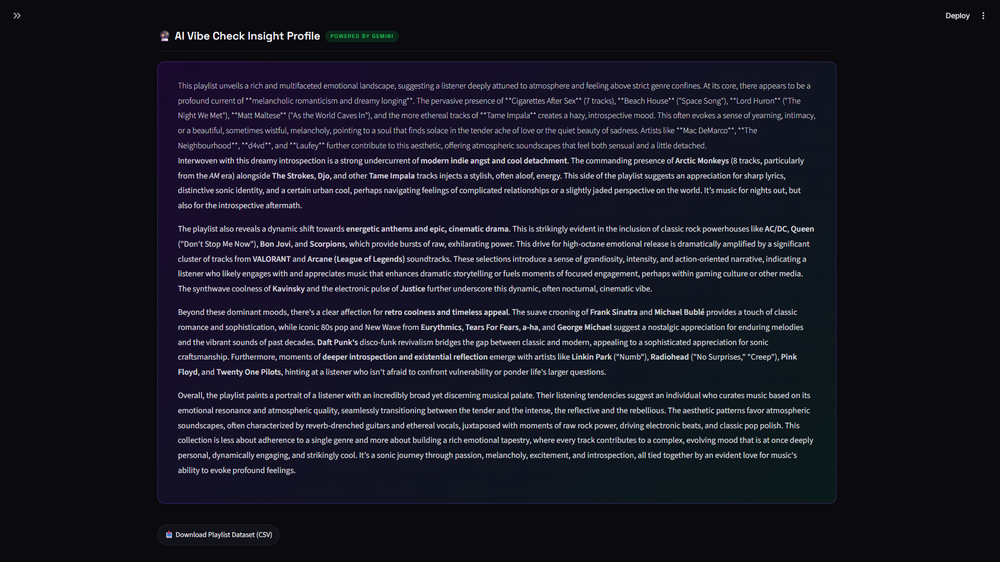

# 🎵 Psychefy

> Decode the acoustics and emotional atmosphere behind your music.

Psychefy is an AI-powered Spotify playlist intelligence engine that combines playlist metadata, visual analytics, and large language models to uncover the patterns, moods, and aesthetic themes hidden inside Spotify playlists.

Rather than focusing on listening statistics alone, Psychefy explores *how a playlist feels* — analyzing musical eras, artist distributions, listening timelines, and emotional atmosphere to generate an AI-powered vibe profile.

---

## ✨ Features

### 🎧 Spotify Integration
- Login with your Spotify account
- Analyze your own playlists
- Analyze collaborative playlists
- Analyze playlists directly from a Spotify URL
- Automatic pagination support for large playlists

### 📊 Structural Metadata Analysis

Psychefy automatically extracts and analyzes:

- Total tracks
- Total playlist duration
- Average track length
- Unique artists
- Unique albums
- Top artists
- Artist concentration
- Oldest and newest tracks
- Dominant music era
- Peak playlist-building period

---

### 📈 Visualization Dashboard

Interactive analytics including:

- Top Artist Distribution
- Music Era Breakdown
- Listening Fixation Timeline
- Track Length Distribution

---

### 🔮 AI Vibe Analysis

Using Google's Gemini API, Psychefy generates a narrative interpretation of:

- Emotional atmosphere
- Musical identity
- Recurring themes
- Aesthetic patterns
- Listening tendencies

The AI is instructed to analyze the playlist itself rather than making assumptions about the listener's personal life.

---

### 📥 Data Export

- Export complete playlist datasets as CSV
- Includes metadata used throughout the analysis pipeline

---

## 📸 Screenshots

### Dashboard Overview



### Structural Metadata Analysis



### Tracklist & Cover Art Details



### Visualization Dashboard



### AI Vibe Analysis



---

## 🛠️ Tech Stack

### Backend
- Python
- Spotipy
- Pandas

### APIs
- Spotify Web API
- Google Gemini API

### Frontend
- Streamlit
- Custom CSS Styling

### Visualization
- Matplotlib
- Seaborn

### Development Tools
- Git
- GitHub

---

## 🚀 Installation

### Clone the Repository

```bash
git clone https://github.com/Utkarsh4819/Psychefy.git
cd Psychefy
```

### Create a Virtual Environment

```bash
python -m venv venv
```

### Activate the Environment

#### Windows

```bash
venv\Scripts\activate
```

#### Linux / macOS

```bash
source venv/bin/activate
```

### Install Dependencies

```bash
pip install -r requirements.txt
```

---

## 🔑 Environment Variables

Create a `.env` file in the project root.

```env
client_Id=YOUR_SPOTIFY_CLIENT_ID
client_secret=YOUR_SPOTIFY_CLIENT_SECRET
GEMINI_API_KEY=YOUR_GEMINI_API_KEY
```

---

## ▶️ Running Psychefy

```bash
streamlit run app.py
```

After authentication, choose a playlist and run a comprehensive analysis.

---

## 📂 Project Structure

```text
Psychefy/
│
├── app.py
├── requirements.txt
├── README.md
│
├── .streamlit/
│   └── config.toml
│
├── archive/
│   ├── psychefy_v1_cli.py
│   ├── psychefy_v2_dashboard.py
│   └── psychefy_v3_streamlit.py
│
└── screenshots/
```

---

## 📚 What I Learned

Building Psychefy provided hands-on experience with:

- OAuth Authentication
- Spotify API Integration
- Pagination Handling
- JSON Parsing
- Data Processing with Pandas
- Data Visualization
- Prompt Engineering
- Streamlit Development
- Git & GitHub Workflows
- Debugging Real-World APIs
- AI-Assisted Development

---

## 🗺️ Project Evolution

### Version 1
CLI-based Spotify playlist analyzer

### Version 2
Added playlist discovery, visualizations, and enhanced metadata analysis

### Version 3
Introduced a Streamlit frontend

### Version 4
Redesigned the UI into a Spotify-inspired analytics dashboard

---

## 🔮 Future Ideas

- Audio Feature Integration
- Playlist Comparison
- Multi-Playlist Analysis
- Advanced AI Reports
- Personalized Recommendation Engine

---

## 👨‍💻 Author

Utkarsh Chauhan

Built as a summer project to learn APIs, data analysis, AI integration, and full project development through hands-on experimentation.

---

## 📄 License

This project is released for educational and portfolio purposes.
